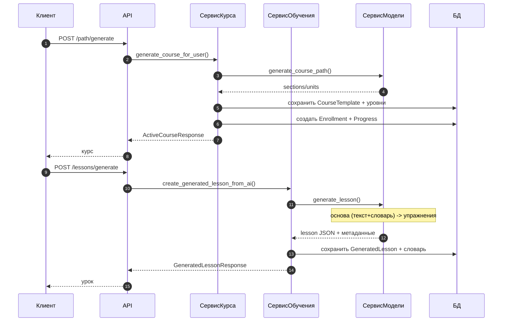

# NeuroGlossAI Backend — документация (от А до Я)

## 1. Назначение

Backend — это API и бизнес‑логика NeuroGlossAI.

Основные возможности:
- аутентификация (JWT)
- генерация курса по интересам (курс = шаблоны + запись прохождения пользователя)
- генерация уроков (текст, словарь, упражнения) через модель
- повторение словаря (нормализованный словарь + интервальные повторения)
- roleplay‑чат
- события (начисление опыта/достижения)
- аналитика вызовов модели (события генерации) и кэш ответов

## 2. Технологии

- **FastAPI**
- **SQLAlchemy 2.x (async)**
- **Alembic** (миграции)
- **PostgreSQL** (по умолчанию в Docker)
- **SQLite** (опционально для локальной разработки)
- **Groq SDK** (провайдер модели)
- **slowapi** (rate limiting)
- **pytest + pytest-asyncio** (тесты)

## 3. Структура проекта

```
backend/
  app/
    api/
      deps.py                    # зависимости FastAPI (get_db, сервисы, current_user)
      v1/
        router.py                # подключение роутеров
        endpoints/               # /auth /users /path /lessons /vocabulary /roleplay /gamification
    core/
      config.py                  # Settings (ENV, DATABASE_URL, SECRET_KEY, GROQ_API_KEY и т.д.)
      database.py                # async engine + session factory + get_db
      security.py                # хэши паролей, создание токена
      exceptions.py              # единый формат ошибок
      rate_limit.py              # limiter
      ai/
        base.py                  # базовый интерфейс провайдера модели
        groq_provider.py         # провайдер «Грок»
      events/
        base.py                  # EventBus + события
        listeners.py             # XPListener, AchievementListener
    models/                      # SQLAlchemy модели
    repositories/                # доступ к данным
    schemas/                     # Pydantic схемы
    services/                    # бизнес‑логика (курс, обучение, модель, авторизация)
    utils/
      prompt_templates.py        # шаблоны промптов
    main.py                      # создание приложения и middleware

  alembic/
    env.py
    versions/                    # миграции
  alembic.ini
  Dockerfile
  requirements.txt
  pytest.ini
  tests/
```

## 4. Быстрый старт (Docker)

### 4.1. Требования
- Docker Desktop
- свободные порты:
  - backend: **8000**
  - postgres: **5433** (наружу) → **5432** (внутри контейнера)

### 4.2. Запуск
Из корня репозитория:

```
docker compose up --build
```

После запуска API доступно:
- `http://localhost:8000/api/v1/openapi.json`
- `http://localhost:8000/docs`

### 4.3. Миграции в Docker
Если нужно вручную применить миграции:

```
docker compose exec backend alembic upgrade head
```

## 5. Локальный запуск (без Docker)

### 5.1. Требования
- Python 3.11+

### 5.2. Установка зависимостей

```
pip install -r requirements.txt
```

### 5.3. Переменные окружения
Создай `backend/.env` (пример):

```
DATABASE_URL=sqlite+aiosqlite:///./data/neurogloss.db
SECRET_KEY=dev-secret-change-me
GROQ_API_KEY=
ENV=development
```

### 5.4. Запуск

```
uvicorn app.main:app --reload --host 127.0.0.1 --port 8000
```

## 6. Конфигурация (Settings)

Файл: `app/core/config.py`

Ключевые параметры:
- **DATABASE_URL** — строка подключения
- **SECRET_KEY** — ключ подписи JWT
- **ENV** — `development | staging | production`
- **LOG_LEVEL** — например `INFO`

ИИ:
- **AI_ENABLED** — включение/выключение ИИ
- **GROQ_API_KEY** — ключ провайдера
- **GROQ_FALLBACK_MODELS** — список моделей для фоллбэка
- **AI_CIRCUIT_BREAKER_FAIL_THRESHOLD** — порог ошибок
- **AI_CIRCUIT_BREAKER_OPEN_SECONDS** — «бан» модели на время

CORS:
- **BACKEND_CORS_ORIGINS** — список источников

Важно:
- В `production` запрещён `*` в CORS (защита)

## 7. База данных и модели

### 7.1. Основная идея
Курс хранится как:
- **шаблон курса** (CourseTemplate + секции/юниты/уровни)
- **запись прохождения курса пользователем** (Enrollment)
- **прогресс по уровням** (UserLevelProgress)
- **сгенерированные уроки** отдельно (GeneratedLesson + GeneratedVocabularyItem)

Это заменяет старую «пользовательскую структуру path».

### 7.2. Ключевые таблицы
- `users`
- `course_templates`, `course_section_templates`, `course_unit_templates`, `course_level_templates`
- `enrollments`
- `user_level_progress`
- `generated_lessons`, `generated_vocabulary_items`
- `lexemes`, `user_lexemes`, `lesson_lexemes` (нормализованный словарь)
- `llm_cache_entries` (кэш ответов модели)
- `ai_generation_events` (аналитика генерации)

## 8. Миграции (Alembic)

- конфиг: `backend/alembic.ini`
- окружение: `backend/alembic/env.py`
- версии: `backend/alembic/versions/`

Типовые команды:

```
alembic revision -m "описание" --autogenerate
alembic upgrade head
alembic downgrade -1
```

Примечание: часть миграций может быть необратимой (например после удаления legacy таблиц).

## 9. API: роуты и назначение

Маршрутизатор: `app/api/v1/router.py`

### 9.1. /auth
- регистрация
- логин
- получение профиля

### 9.2. /users
- обновление языков
- экспорт данных
- сброс контента пользователя
- частичное обновление профиля

### 9.3. /path
- генерация курса по интересам
- получение активного курса
- полная генерация (курс + несколько уроков)
- повтор генерации уроков/частей урока

### 9.4. /lessons
- генерация урока
- регенерация упражнений
- регенерация основы урока

### 9.5. /vocabulary
- review слова (оценка → пересчёт интервала)

### 9.6. /roleplay
- чат‑ответ модели по истории сообщений

### 9.7. /gamification
- заглушка эндпойнтов геймификации

## 10. Сервисы и поток данных

### 10.1. CourseService (`app/services/course_service.py`)
Отвечает за:
- генерацию CourseTemplate через модель
- создание Enrollment
- создание UserLevelProgress для всех уровней
- выдачу «active course view»
- обновление прогресса и публикацию событий

### 10.2. LearningService (`app/services/learning_service.py`)
Отвечает за:
- создание GeneratedLesson по уровню курса
- запись GeneratedVocabularyItem
- регенерации (основа / упражнения)
- апсерт словаря в нормализованную модель (Lexeme/UserLexeme/LessonLexeme)
- обработку review слова
- best‑effort запись `ai_generation_events`

### 10.3. AIService (`app/services/ai_service.py`)
Отвечает за:
- генерацию основы урока (текст + словарь)
- генерацию упражнений
- нормализацию результата (в т.ч. обработка кириллических «похожих» букв)
- валидацию и структурированные ошибки
- repair: попытки «починки» ответа по ошибкам
- режимы генерации:
  - `fast` (меньше попыток/починок)
  - `balanced`
  - `strict` (больше попыток/починок)

Кэш и устойчивость:
- кэш ответов модели через `llm_cache_entries`
- фоллбэк по моделям
- «предохранитель» (circuit breaker) на transient ошибки

## 11. Кэш ответов модели

Таблица: `llm_cache_entries`

Идея:
- считаем хэш от (провайдер, модель, промпт)
- если уже есть ответ — возвращаем из базы
- при успехе сохраняем ответ
- если параллельно вставили то же самое (уникальный ключ) — это не ошибка (обрабатываем)

Кэш используется и для repair‑шагов.

## 12. Аналитика генерации

Таблица: `ai_generation_events`

Записываем (best‑effort):
- операция (генерация урока / регенерация)
- задержка
- режим генерации
- статус качества
- коды ошибок валидации

## 13. События

- EventBus: `app/core/events/base.py`
- слушатели: `app/core/events/listeners.py`
- подписка выполняется в `app/main.py`

Текущий поток:
- при завершении уровня публикуется событие
- слушатели начисляют опыт и проверяют достижения

## 14. Rate limiting

Используется `slowapi`.

Limiter подключён в `app/main.py` и хранится в `app.state.limiter`.

## 15. Тестирование

Запуск в Docker:

```
docker compose exec backend pytest -q
```

Запуск выборочно:

```
docker compose exec backend pytest -q tests/test_e2e_scenarios.py::test_full_user_journey
```

Важно:
- некоторые тесты используют моки модели, чтобы избежать реальных вызовов
- есть отдельный E2E тест, который может реально ходить в модель и запускается вручную через переменные окружения

## 16. Типовые проблемы и решения

### 16.1. Долгие тесты
Причина:
- реальные вызовы модели
- ретраи и repair‑попытки

Решение:
- использовать моки
- запускать выборочно

### 16.2. Ошибка чтения .env
Если видишь предупреждение `python-dotenv could not parse ...`:
- проверь формат первой строки `.env` (должно быть `КЛЮЧ=значение`)
- пересохрани файл как UTF‑8 без BOM

### 16.3. Ошибки миграций
- убедись, что применил `alembic upgrade head`
- проверь, что `DATABASE_URL` указывает на ту же БД, куда ты применяешь миграции

## 17. Полезные команды

- миграции:
  - `alembic upgrade head`
- тесты:
  - `pytest -q`
  - `pytest -q --durations=10`
- docker:
  - `docker compose up --build`
  - `docker compose exec backend bash`

---

## 18. Эндпойнты (полный список + примеры)

Базовый префикс API задаётся в `Settings.API_V1_STR` и по умолчанию равен `/api/v1`.

### 18.1. Auth (`/api/v1/auth`)

#### POST `/register`

Пример запроса:

```bash
curl -s -X POST http://localhost:8000/api/v1/auth/register \
  -H "Content-Type: application/json" \
  -d '{"username":"demo","email":"demo@example.com","password":"strongpassword123"}'
```

Пример ответа:

```json
{
  "id": "...",
  "username": "demo",
  "email": "demo@example.com",
  "native_language": "Russian",
  "target_language": "Kazakh",
  "xp": 0,
  "interests": []
}
```

#### POST `/login`

Важно: используется `OAuth2PasswordRequestForm`, то есть `Content-Type: application/x-www-form-urlencoded`.

```bash
curl -s -X POST http://localhost:8000/api/v1/auth/login \
  -H "Content-Type: application/x-www-form-urlencoded" \
  -d "username=demo&password=strongpassword123"
```

Ответ:

```json
{
  "access_token": "...",
  "token_type": "bearer"
}
```

#### GET `/me`

```bash
curl -s http://localhost:8000/api/v1/auth/me \
  -H "Authorization: Bearer <token>"
```

### 18.2. Users (`/api/v1/users`)

#### PUT `/me/languages`

```bash
curl -s -X PUT http://localhost:8000/api/v1/users/me/languages \
  -H "Authorization: Bearer <token>" \
  -H "Content-Type: application/json" \
  -d '{"target_language":"English","native_language":"Russian"}'
```

#### GET `/me/export`

Полезно для отладки: возвращает основные сущности пользователя одним объектом.

```bash
curl -s http://localhost:8000/api/v1/users/me/export \
  -H "Authorization: Bearer <token>"
```

#### POST `/me/reset`

Удаляет контент пользователя (курс/прогресс/сгенерированные уроки/словарь), сохраняя опыт.

```bash
curl -s -X POST http://localhost:8000/api/v1/users/me/reset \
  -H "Authorization: Bearer <token>"
```

#### PATCH `/me`

Частичное обновление профиля.

```bash
curl -s -X PATCH http://localhost:8000/api/v1/users/me \
  -H "Authorization: Bearer <token>" \
  -H "Content-Type: application/json" \
  -d '{"username":"new_name","interests":["Travel","Music"]}'
```

### 18.3. Path / Курс (`/api/v1/path`)

#### GET `/`

Возвращает «активный курс» (шаблон курса + прогресс) в виде `ActiveCourseResponse`.

```bash
curl -s http://localhost:8000/api/v1/path/ \
  -H "Authorization: Bearer <token>"
```

#### POST `/generate`

Перегенерация курса по интересам.

```bash
curl -s -X POST http://localhost:8000/api/v1/path/generate \
  -H "Authorization: Bearer <token>" \
  -H "Content-Type: application/json" \
  -d '{"interests":["Travel","Music"],"level":"A1","regenerate":true}'
```

Ответ: тот же формат, что и GET `/path/`.

#### PATCH `/progress`

Обновляет прогресс уровня и разблокирует следующий уровень.

```bash
curl -s -X PATCH http://localhost:8000/api/v1/path/progress \
  -H "Authorization: Bearer <token>" \
  -H "Content-Type: application/json" \
  -d '{"level_template_id":"...","status":"completed","stars":3,"xp_gained":50}'
```

Пример ответа:

```json
{
  "status": "success",
  "new_status": "completed",
  "next_level_unlocked": true,
  "user_total_xp": 50
}
```

#### POST `/generate-full`

Один вызов: генерирует курс, затем генерирует несколько уроков для первых тем.

Пример запроса:

```bash
curl -s -X POST http://localhost:8000/api/v1/path/generate-full \
  -H "Authorization: Bearer <token>" \
  -H "Content-Type: application/json" \
  -d '{"interests":["Travel"],"level":"A1","max_topics":3,"sleep_seconds":0,"regenerate_path":true,"force_regenerate_lessons":false,"generation_mode":"balanced"}'
```

Ответ содержит:
- `course` (активный курс)
- `lessons` (массив сгенерированных уроков)
- `failed_topics` и `retry_after_seconds` при частичном успехе

#### POST `/retry-lessons`

Перегенерация выбранных уроков по `level_template_id`.

Поля:
- `mode`: `full | core | exercises`
- `generation_mode`: `fast | balanced | strict`

```bash
curl -s -X POST http://localhost:8000/api/v1/path/retry-lessons \
  -H "Authorization: Bearer <token>" \
  -H "Content-Type: application/json" \
  -d '{"level_template_ids":["..."],"level":"A1","sleep_seconds":0,"mode":"core","generation_mode":"balanced"}'
```

### 18.4. Lessons (`/api/v1/lessons`)

#### POST `/generate`

Генерирует урок для конкретного `level_template_id` (требует активный курс).
Эндпойнт ограничен: `5/minute`.

```bash
curl -s -X POST http://localhost:8000/api/v1/lessons/generate \
  -H "Authorization: Bearer <token>" \
  -H "Content-Type: application/json" \
  -d '{"level_template_id":"...","topic":"Travel","level":"A1","generation_mode":"balanced"}'
```

Ответ: `GeneratedLessonResponse` (включая `content_text`, `vocabulary_items`, `exercises`).

#### GET `/`

Список сгенерированных уроков текущего активного курса.

```bash
curl -s http://localhost:8000/api/v1/lessons/?skip=0\&limit=10 \
  -H "Authorization: Bearer <token>"
```

#### GET `/{id}`

Получение одного урока.

#### POST `/{id}/regen-exercises`

Перегенерация только упражнений на основе сохранённого текста и словаря.

#### POST `/{id}/regen-core`

Перегенерация только основы (текст + словарь), упражнения очищаются и урок помечается как требующий проверки.

### 18.5. Vocabulary (`/api/v1/vocabulary`)

#### GET `/daily-review`

Список слов, которые «к повторению» по расписанию.

#### POST `/review`

Оценка качества ответа пользователя (например 1..5) → пересчёт интервала.

```bash
curl -s -X POST http://localhost:8000/api/v1/vocabulary/review \
  -H "Authorization: Bearer <token>" \
  -H "Content-Type: application/json" \
  -d '{"vocabulary_id":"...","rating":5}'
```

### 18.6. Roleplay (`/api/v1/roleplay`)

#### POST `/chat`

```bash
curl -s -X POST http://localhost:8000/api/v1/roleplay/chat \
  -H "Authorization: Bearer <token>" \
  -H "Content-Type: application/json" \
  -d '{"scenario":"Meeting a pro player","role":"Layla","message":"Hi!","history":[],"target_language":"Kazakh","level":"A1"}'
```

Ответ:

```json
{ "response": "..." }
```

### 18.7. Gamification (`/api/v1/gamification`)

Сейчас это заглушки.

#### POST `/buy-freeze`

Возвращает успешный ответ без реальной логики списания.

---

## 19. Модели данных (поля, связи, ограничения)

Ниже перечислены основные модели. Типы приведены на уровне концепции (точные типы см. в SQLAlchemy моделях).

### 19.1. User (`users`)

Поля:
- `id`
- `username` (unique)
- `email` (unique)
- `hashed_password`
- `native_language` (по умолчанию Russian)
- `target_language` (по умолчанию Kazakh)
- `xp`
- `language_levels` (json)
- `interests` (json)

Связи:
- `streaks` → Streak

### 19.2. Streak (`streaks`)

Поля:
- `id`
- `user_id`
- `current_streak`
- `last_activity_date`

Связи:
- `user` → User

### 19.3. CourseTemplate (`course_templates`)

Поля:
- `id`
- `slug`
- `target_language`
- `theme`
- `cefr_level`
- `version`
- `is_active`
- `interests` (json)
- `created_at`

Ограничения:
- unique (`slug`, `version`)

Связи:
- `sections` → CourseSectionTemplate (упорядочено по `order`, каскадное удаление)

### 19.4. CourseSectionTemplate (`course_section_templates`)

Поля:
- `id`
- `course_template_id`
- `order`
- `title`
- `description`

Ограничения:
- unique (`course_template_id`, `order`)

Связи:
- `units` → CourseUnitTemplate (упорядочено по `order`, каскадное удаление)

### 19.5. CourseUnitTemplate (`course_unit_templates`)

Поля:
- `id`
- `section_template_id`
- `order`
- `topic`
- `description`
- `icon`

Ограничения:
- unique (`section_template_id`, `order`)

Связи:
- `levels` → CourseLevelTemplate (упорядочено по `order`, каскадное удаление)

### 19.6. CourseLevelTemplate (`course_level_templates`)

Поля:
- `id`
- `unit_template_id`
- `order`
- `type` (например lesson/practice/trophy)
- `total_steps`
- `goal`

Ограничения:
- unique (`unit_template_id`, `order`)

Связи:
- `progresses` → UserLevelProgress
- `generated_lessons` → GeneratedLesson

### 19.7. Enrollment (`enrollments`)

Поля:
- `id`
- `user_id`
- `course_template_id`
- `status` (active/archived)
- `created_at`

Ограничения:
- unique (`user_id`, `course_template_id`)

Связи:
- `progresses` → UserLevelProgress (каскадное удаление)
- `generated_lessons` → GeneratedLesson (каскадное удаление)

### 19.8. UserLevelProgress (`user_level_progress`)

Поля:
- `id`
- `enrollment_id`
- `level_template_id`
- `status` (locked/in_progress/completed/gold)
- `stars`
- `created_at`
- `completed_at`

Ограничения:
- unique (`enrollment_id`, `level_template_id`)

### 19.9. GeneratedLesson (`generated_lessons`)

Поля:
- `id`
- `enrollment_id`
- `level_template_id`
- `topic_snapshot`
- `prompt_version`
- `provider`, `model`
- `input_context` (json)
- `raw_model_output` (json)
- `validation_errors` (json)
- `repair_count`
- `content_text`
- `exercises` (json)
- `quality_status` (ok/needs_review)
- `created_at`

Ограничения:
- unique (`enrollment_id`, `level_template_id`)

Связи:
- `vocabulary_items` → GeneratedVocabularyItem (каскадное удаление)

### 19.10. GeneratedVocabularyItem (`generated_vocabulary_items`)

Поля:
- `id`
- `generated_lesson_id`
- `user_lexeme_id` (nullable)
- `word`
- `translation`
- `context_sentence`
- `mastery_level`
- `next_review_at`
- `created_at`

Связи:
- `user_lexeme` → UserLexeme

### 19.11. Нормализованный словарь (SRS)

#### Lexeme (`lexemes`)

Поля:
- `id`
- `target_language`
- `text`
- `normalized`
- `part_of_speech`

Ограничения:
- unique (`target_language`, `normalized`)

#### UserLexeme (`user_lexemes`)

Поля:
- `id`
- `user_id`
- `enrollment_id` (nullable)
- `lexeme_id`
- `translation_preferred`
- `context_sentence_preferred`
- `mastery_level`
- `next_review_at`
- `first_seen_at`
- `last_reviewed_at`
- `extra_metadata` (json)

Ограничения:
- unique (`user_id`, `lexeme_id`)

#### LessonLexeme (`lesson_lexemes`)

Поля:
- `id`
- `generated_lesson_id`
- `lexeme_id`
- `user_lexeme_id` (nullable)
- `translation`
- `context_sentence`

Ограничения:
- unique (`generated_lesson_id`, `lexeme_id`)

### 19.12. Попытки уровня

UserLevelAttempt (`user_level_attempts`): хранит попытки прохождения уровня, звёзды, опыт и снимок ответов.

### 19.13. Операции модели

#### LLMCacheEntry (`llm_cache_entries`)

Кэш: уникален по `prompt_hash`.

#### AIGenerationEvent (`ai_generation_events`)

События генерации: операция, задержка, режим, статус качества и коды ошибок.

---

## 20. Как работает генерация курса и урока (пошагово)

### 20.1. Генерация курса (`/path/generate`)

1) Клиент вызывает `/path/generate` с интересами и уровнем.
2) `CourseService.generate_course_for_user()`:
   - архивирует предыдущие активные записи курса (если `regenerate=true`)
   - вызывает `AIService.generate_course_path()` → получает структуру секций/юнитов
   - сохраняет `CourseTemplate`, `CourseSectionTemplate`, `CourseUnitTemplate`
   - создаёт стандартные уровни (`CourseLevelTemplate`) на каждый юнит
   - создаёт `Enrollment`
   - создаёт `UserLevelProgress` для всех уровней и разблокирует первый
3) Клиент читает `GET /path/` (или получает курс сразу ответом).

### 20.2. Генерация урока (`/lessons/generate`)

1) Клиент вызывает `/lessons/generate` с `level_template_id`, темой и уровнем.
2) `LearningService.create_generated_lesson_from_ai()`:
   - проверяет, есть ли уже `GeneratedLesson` для (`enrollment_id`, `level_template_id`)
   - если нужно, вызывает `AIService.generate_lesson()`
3) `AIService.generate_lesson()`:
   - шаг A: `generate_text_vocab_only()` → текст + словарь
     - нормализация
     - валидация
     - починка ответа по ошибкам (несколько попыток в зависимости от режима)
   - шаг B: генерация упражнений по тексту/словарю
     - валидация упражнений
     - починка упражнений по ошибкам (несколько попыток)
     - мягкая деградация: если упражнения не удаётся получить — сохраняем урок без упражнений и помечаем как требующий проверки
   - возвращает результат с `_meta` (режим, попытки, коды ошибок)
4) `LearningService` сохраняет `GeneratedLesson` и `GeneratedVocabularyItem`.
5) Дополнительно:
   - обновляет нормализованный словарь (Lexeme/UserLexeme/LessonLexeme)
   - пишет событие генерации в `ai_generation_events` (по возможности)

### 20.3. Диаграмма (Mermaid)



